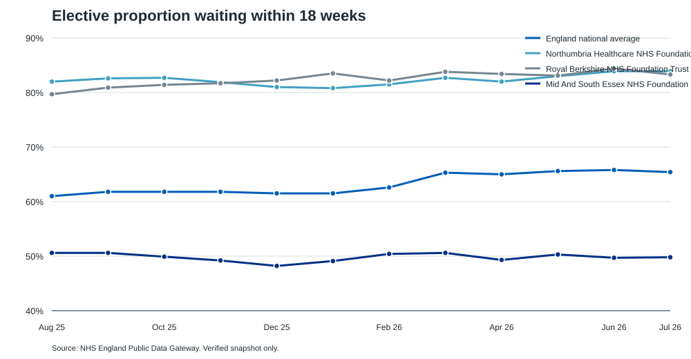
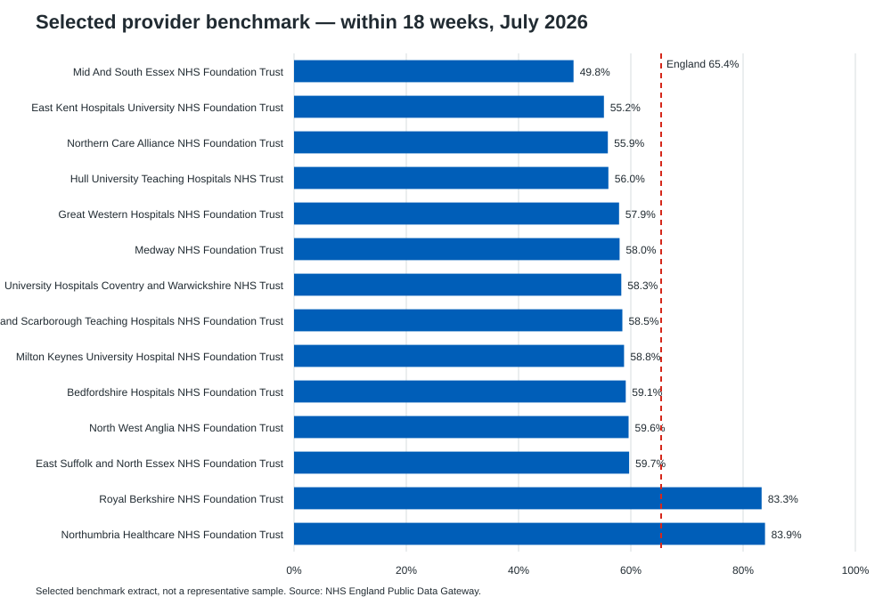
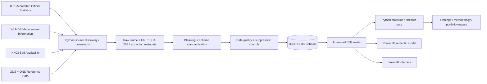

# NHS Elective Care Intelligence
## Waiting List, Capacity & Health Inequality Analytics

A reproducible analytics-engineering portfolio project that converts public NHS England elective-care data into operational screening intelligence: backlog pressure, long waits, demand vs throughput, provider/specialty prioritisation, bed-capacity proxies and suppression-aware health-inequality analysis.

> **Data integrity first:** monthly RTT Accredited Official Statistics are the headline source; WLMDS is explicitly treated as management information; suppressed demographic cells are never reconstructed; pathways are not described as unique patients; bed occupancy is labelled a capacity proxy; no unsupported causal or business-impact claim is made.





## Executive summary

The production architecture discovers current NHS publication files, caches immutable raw downloads with checksums, standardises schemas, validates data, loads a DuckDB star schema, runs advanced SQL/Python analytics, and produces dashboard-ready marts for Power BI/Streamlit.

The build environment used for this repository could inspect official NHS webpages but could not fetch NHS ZIP/XLSX/CSV attachments. Rather than invent full-source outputs, the executed evidence layer contains a **62-record official NHS England gateway verification dataset** (48 monthly records + 14 selected July-2026 provider rows), while the bulk RTT/WLMDS/KH03 ingestion code remains reproducible for a normal networked machine. **44/44 automated tests passed.**

### Verified findings from executed official data

- England’s published **within-18-week proportion rose from 61.0% (Aug 2025) to 65.4% (Jul 2026), +4.4 percentage points**.
- England’s published **over-52-week proportion fell from 2.6% to 1.5%, -1.1pp** over the same period.
- NHS England reported that the absolute waiting list nevertheless **increased by 55,961 to 7.3 million in July 2026**, demonstrating why backlog stock and timeliness must be read together.
- In the verified provider sample, **Northumbria** reached 83.9% within 18 weeks in July 2026 (+18.5pp vs England); **Royal Berkshire** reached 83.3% (+17.9pp); **Mid And South Essex** was 49.8% (-15.6pp) and 7.9% over 52 weeks (+6.4pp vs England), making it a defensible candidate for deeper specialty/flow investigation rather than a causal judgement.

Full evidence and caveats: [`reports/findings.md`](reports/findings.md).

## Business problem

The platform is designed to answer:

- Where is elective-care pressure greatest across England?
- Which providers/specialties have severe or fast-growing waiting-list pressure?
- Which organisations are improving or deteriorating?
- Is recorded demand entering faster than pathways are completed?
- Where are long waits concentrated?
- How does backlog compare with recorded throughput and bed-capacity proxies?
- What observable waiting-list composition / long-wait differences exist by deprivation, ethnicity, age and sex?
- Which provider/specialty combinations should an analytical or operational team investigate first?

It is a **service-level analytical decision-support portfolio**, not a clinical decision tool or patient-level risk model.

## Architecture



## Authoritative data sources

| Source | Role | Status / latest inspected at build time |
|---|---|---|
| [NHS England RTT](https://www.england.nhs.uk/statistics/statistical-work-areas/rtt-waiting-times/) | Headline incomplete pathways, completions, new periods, wait bands | Monthly Accredited Official Statistics; latest inspected **July 2026** |
| [NHS England WLMDS](https://www.england.nhs.uk/statistics/statistical-work-areas/rtt-waiting-times/wlmds/) | Weekly/detail/demographic analysis | Management information; landing page exposed data to **26 July 2026** |
| [NHS England KH03](https://www.england.nhs.uk/statistics/statistical-work-areas/bed-availability-and-occupancy/bed-availability-and-occupancy-kh03/) | Available/occupied bed days | Quarterly; timeseries through **Q1 2026/27** |
| [NHS England ODS](https://digital.nhs.uk/services/organisation-data-service) | Provider codes, names, status, organisation changes | DSE/API reference data; updated nightly |
| [ONS mid-2025 population estimates](https://www.ons.gov.uk/releases/populationestimatesforenglandandwalesmid2025) | Optional compatible denominators | Accredited Official Statistics; released 29 Jul 2026 |

Detailed source register: [`reports/source_register.md`](reports/source_register.md).

## Analytical model

The model separates incompatible concepts instead of building one giant CSV:

- Dimensions: `dim_date`, `dim_provider`, `dim_specialty`, `dim_wait_band`, `dim_demographic`, `dim_deprivation`
- Facts: `fact_rtt_waiting_list`, `fact_rtt_activity`, `fact_wlmds_pathways`, `fact_wlmds_demographics`, `fact_bed_availability`, `fact_bed_occupancy`
- Audit: `data_quality_results`, `source_registry`
- Mart: `mart_provider_monthly`

See [`database/data_dictionary.md`](database/data_dictionary.md) and [`database/er_diagram.md`](database/er_diagram.md).

## Core KPIs

Implemented/specified where supported by actual source fields:

- Total incomplete pathways; 18-week performance; >52-week pathways/rate
- MoM / YoY backlog change; rolling backlog/activity
- New RTT pathways; admitted + non-admitted completions
- Demand-to-throughput ratio; clearance ratio; net pathway pressure
- Backlog per monthly completion (scenario ratio, **not a forecast**)
- Provider/specialty shares and ranks; persistent deterioration streaks
- Bed occupancy and completions per available bed-day (**capacity proxies**)
- Suppression-safe demographic gaps/ratios when compatible cells exist

## Advanced SQL

The `sql/` layer demonstrates CTEs, `LAG`, rolling windows, `SUM/AVG OVER`, `DENSE_RANK`, `NTILE`, `PERCENT_RANK`, conditional aggregation, date arithmetic and multi-table joins against real business questions:

1. provider monthly KPIs / MoM / YoY / rolling demand-throughput;
2. consecutive-month deterioration;
3. pressure percentiles;
4. rank stability;
5. specialty backlog drivers;
6. provider-level KH03 bed-capacity proxy;
7. suppression-safe deprivation gap logic;
8. suppression-safe long-wait inequality logic.

## Health inequality safeguards

WLMDS demographic data are handled with a four-state value model: `observed`, `suppressed`, `missing`, `not_applicable`. Small published cells are never imputed or reverse-engineered. Without a compatible population denominator, results are described as **waiting-list composition**, not population prevalence. Provider catchments are not assumed to equal local-authority/LSOA populations, and no causal claim about discrimination is inferred from aggregate associations.

See [`reports/inequalities.md`](reports/inequalities.md).

## Capacity methodology

KH03 available bed days are published by sector, while occupied bed days are broken down by consultant main specialty. The project therefore stores them in separate facts, aggregates them independently to provider/quarter/bed-type grain, and uses the resulting occupancy/activity-per-bed-day measures only as **bed/operational capacity proxies**. It does not claim beds represent total elective capacity and does not force a specialty join between KH03 consultant specialty and RTT treatment function.

## Forecasting

Forecasts are gated by minimum history and data quality. The executed 12-month gateway verification series fails the configured 24-month readiness threshold, so **no forecast is published** from insufficient history. A full RTT refresh can compare naive/seasonal-naive baselines with ETS/ARIMA using time-based validation and MAE/RMSE/sMAPE where appropriate.

## Dashboard delivery

A native PBIX cannot be generated reliably in this environment, so the repository provides:

- Power BI star-schema specification;
- DAX measure library;
- eight-page executive dashboard design;
- filter/drill-through behaviour;
- Power Query guidance;
- accessible theme JSON;
- dashboard-ready export script;
- two data-backed prototype screenshots;
- locally runnable Streamlit app.

See [`dashboard/dashboard_specification.md`](dashboard/dashboard_specification.md).

## Data quality and testing

**Local validation: 44 tests passed, 0 failed.** Tests cover suppression parsing, denominator handling, metric formulas, rolling calculations, duplicate detection, null/negative checks, ODS code validity, inequality propagation, pressure-score explainability, forecast readiness, official gateway fixture values and RTT source-grain/part/wait-band transformations.

The production quality framework additionally flags schema drift, missing submissions, unexpected wait bands, extreme MoM changes, referential-integrity issues and headline reconciliation differences. Suspicious values are flagged for investigation rather than silently deleted.

See [`reports/data_quality.md`](reports/data_quality.md).

## Reproduce

```bash
python -m venv .venv
source .venv/bin/activate          # Windows: .venv\\Scripts\\activate
python -m pip install --upgrade pip
pip install -e .[dev]
pytest
python scripts/run_pipeline.py --stage download
python scripts/run_pipeline.py --stage rtt
python scripts/run_sql_analysis.py
python scripts/generate_dashboard_exports.py
streamlit run app/streamlit_app.py
```

Full instructions: [`docs/reproduction.md`](docs/reproduction.md).

## Repository structure

```text
nhs-elective-care-intelligence/
├── README.md
├── config/                  # source/project configuration
├── data/                    # ignored raw/interim; small verified reference fixtures
├── database/                # DuckDB schema, dictionary, ER model
├── src/                     # ingestion, cleaning, validation, analytics, forecasting
├── sql/                     # waiting-list/provider/specialty/capacity/inequality analyses
├── tests/                   # automated unit + verification tests
├── dashboard/               # Power BI semantic model, DAX, theme, specs, screenshots
├── app/                     # Streamlit analytical interface
├── reports/                 # findings, DQ, methods, inequalities, limitations, security
├── docs/                    # architecture, reproduction, decision log
├── scripts/                 # pipeline, verified fixture, exports, mockups, security scan
└── .github/workflows/       # CI
```

## Limitations and ethics

Key caveats include RTT pathway definitions, revisions, WLMDS management-information status, missing submissions, demographic suppression/rounding, organisation changes, denominator compatibility, KH03 proxy limitations, pandemic-era bed comparability, forecast uncertainty, ecological fallacy and correlation-vs-causation.

Only public aggregate data are used. No individual is identified; suppressed cells are not reconstructed; no patient-level risk score is created; the project does not make clinical decisions.

Read the full [`reports/limitations.md`](reports/limitations.md) and [`reports/security_review.md`](reports/security_review.md).

## Portfolio material

CV bullets, LinkedIn description and interview explanations are in [`reports/portfolio_materials.md`](reports/portfolio_materials.md), derived only from executed results and implemented artifacts.
