# Analytical model

```mermaid
erDiagram
    DIM_DATE ||--o{ FACT_RTT_WAITING_LIST : reporting_month
    DIM_DATE ||--o{ FACT_RTT_ACTIVITY : reporting_month
    DIM_DATE ||--o{ FACT_WLMDS_PATHWAYS : reporting_month
    DIM_DATE ||--o{ FACT_WLMDS_DEMOGRAPHICS : reporting_month
    DIM_DATE ||--o{ FACT_BED_AVAILABILITY : quarter_end
    DIM_DATE ||--o{ FACT_BED_OCCUPANCY : quarter_end
    DIM_PROVIDER ||--o{ FACT_RTT_WAITING_LIST : provider_code
    DIM_PROVIDER ||--o{ FACT_RTT_ACTIVITY : provider_code
    DIM_PROVIDER ||--o{ FACT_WLMDS_PATHWAYS : provider_code
    DIM_PROVIDER ||--o{ FACT_WLMDS_DEMOGRAPHICS : provider_code
    DIM_PROVIDER ||--o{ FACT_BED_AVAILABILITY : provider_code
    DIM_PROVIDER ||--o{ FACT_BED_OCCUPANCY : provider_code
    DIM_SPECIALTY ||--o{ FACT_RTT_WAITING_LIST : treatment_function_code
    DIM_SPECIALTY ||--o{ FACT_RTT_ACTIVITY : treatment_function_code
    DIM_SPECIALTY ||--o{ FACT_WLMDS_PATHWAYS : treatment_function_code
    DIM_SPECIALTY ||--o{ FACT_WLMDS_DEMOGRAPHICS : treatment_function_code

    DIM_PROVIDER {
      string provider_code PK
      string provider_name
      string region_name
      string status
      string successor_provider_code
    }
    DIM_SPECIALTY {
      string treatment_function_code PK
      string treatment_function_name
    }
    FACT_RTT_WAITING_LIST {
      date reporting_month PK
      string provider_code PK
      string treatment_function_code PK
      double total_incomplete
      double within_18_weeks
      double over_52_weeks
    }
    FACT_RTT_ACTIVITY {
      date reporting_month PK
      string provider_code PK
      string treatment_function_code PK
      double new_rtt_periods
      double admitted_completed
      double non_admitted_completed
    }
    FACT_WLMDS_DEMOGRAPHICS {
      date observation_date PK
      string provider_code PK
      string dimension_name PK
      string category_label PK
      double value
      string value_status
    }
    FACT_BED_AVAILABILITY {
      date quarter_end PK
      string provider_code PK
      string availability_sector PK
      string bed_type PK
      double available_bed_days
    }
    FACT_BED_OCCUPANCY {
      date quarter_end PK
      string provider_code PK
      string consultant_main_specialty PK
      string bed_type PK
      double occupied_bed_days
    }
```

KH03 availability and occupancy are intentionally separate because the official guidance publishes availability by sector but occupied bed days by consultant main specialty. Consultant-main-specialty is **not** linked to RTT treatment function. Ratios are formed only after separate aggregation to a defensible shared provider/quarter/bed-type grain.
