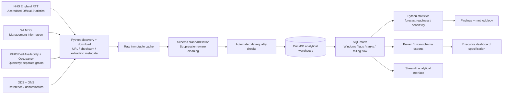

# Architecture

The source hierarchy is intentional: RTT supplies headline official statistics; WLMDS adds detail; KH03 adds separately modelled availability/occupancy series for provider-level bed proxies; ODS stabilises organisation identities; ONS is optional for compatible denominator analyses.
